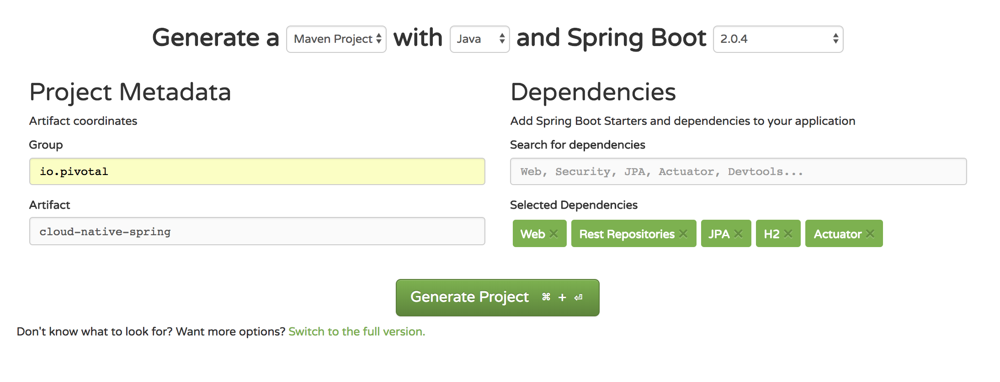

= Lab01: Building a Spring Boot Application

想定時間: 30分-1時間

== Create a Spring Boot Project

. https://start.spring.io に移動

. Maven Project としてSpring Boot 2.0.4で作成

. 下記の内容で*Project metadata*フィールドを埋める:
+
Group:: +io.pivotal+
Artifact:: +cloud-native-spring+
+
NOTE: 複数の受講者が同じSpaceを使う場合は、cloud-native-spring -> cloud-native-YOURNAMEなどでも良いです。

. (Option) "Switch to the full version."をクリックして、"Package Name"をio.pivotalに変更

. "Dependencies" にて、以下をそれぞれ入力（全部をコピペしないように):
+
*Web*, *Rest Repositories*, *JPA*, *H2*, *Actuator*
+

. "Generate Project"ボタンを押すとzipファイルがダウンロードされる

. "Selected Dependencies"で、上記のDependenciesがそれぞれあるのを確認する

. 以下のようにzipファイルを展開 *CN-Workshop-ASY/labs/lab01/cloud-native-spring*

+
このようなディレクトリになることを確認:
+
[source, bash]
---------------------------------------------------------------------
CN-Workshop-ASY:
├── labs
│   ├── lab01
│   │   ├── cloud-native-spring
---------------------------------------------------------------------

. pom.xmlを使ってeditor/IDEで処理
+
*_STSでのプロジェクト・インポート:_*
+
Select File > Import… Then select Maven > Existing Maven Projects.
+
Import Maven Projects ページにて, /cloud-native-spring ディレクトリを確認　 (e.g. CN-Workshop-ASY/labs/lab01/cloud-native-spring)
+

== エンドポイントの追加

. @RestControllerのアノテーションを__io.pivotal.CloudNativeSpringApplication__に追加 (/cloud-native-spring/src/main/java/io/pivotal/CloudNativeSpringApplication.java).
__RestController__クラスのimportも確認

+
[source, java, numbered]
---------------------------------------------------------------------
package io.pivotal;

import org.springframework.boot.SpringApplication;
import org.springframework.boot.autoconfigure.SpringBootApplication;
import org.springframework.web.bind.annotation.RestController;

@SpringBootApplication
@RestController
public class CloudNativeSpringApplication {

    public static void main(String[] args) {
        SpringApplication.run(CloudNativeSpringApplication.class, args);
    }
}
---------------------------------------------------------------------

. 下記のリクエストハンドラを _io.pivotal.CloudNativeSpringApplication_ に追加(/cloud-native-spring/src/main/java/io/pivotal/CloudNativeSpringApplication.java).
__RequestMapping__クラスのimportも確認

+
[source,java]
---------------------------------------------------------------------
@RequestMapping("/hello")
public String hello() {
    return "Hello Spring Boot!";
}
---------------------------------------------------------------------
+
最終版:
+
[source,java]
---------------------------------------------------------------------
package io.pivotal;

import org.springframework.boot.SpringApplication;
import org.springframework.boot.autoconfigure.SpringBootApplication;
import org.springframework.web.bind.annotation.RequestMapping;
import org.springframework.web.bind.annotation.RestController;

@SpringBootApplication
@RestController
public class CloudNativeSpringApplication {

    public static void main(String[] args) {
        SpringApplication.run(CloudNativeSpringApplication.class, args);
    }

    @RequestMapping("/hello")
    public String hello() {
        return "Hello World!";
    }
}
---------------------------------------------------------------------

==  _cloud-native-spring_ アプリの実行

. ターミナルにてディレクトリを変更 *CN-Workshop-ASY/labs/lab01/cloud-native-spring*
+
``
$ cd ./CN-Workshop-ASY/labs/lab01/cloud-native-spring
``
. スタンドアロンでのアプリケーションの実行
+
``
$ ./mvnw clean spring-boot:run
``
NOTE: Windowsユーザの方は、mvnw.cmdを利用して下さい

. サーバ(Tomcat)が起動(8080ポート)しているのを確認:
+
[source,bash]
---------------------------------------------------------------------
2015-10-02 13:26:59.264  INFO 44749 --- [lication.main()] s.b.c.e.t.TomcatEmbeddedServletContainer: Tomcat started on port(s): 8080 (http)
2015-10-02 13:26:59.267  INFO 44749 --- [lication.main()] io.pivotal.hello.CloudNativeSpringApplication: Started CloudNativeSpringApplication in 2.541 seconds (JVM running for 9.141)
---------------------------------------------------------------------

. ブラウザで確認: http://localhost:8080/hello

. *Ctrl + C*でアプリを停止

== _cloud-native-spring_ をCloud Foundryにデプロイ

. アプリケーションのビルド
+
[source,bash]
---------------------------------------------------------------------
$ mvn clean package
# あるいは以下を実行してTestを省略
$ ./mvnw clean install -Dmaven.test.skip=true
---------------------------------------------------------------------

. マニフェストファイルをプロジェクトのルートフォルダに作成します /cloud-native-spring
+
``
$ touch manifest.yml
``
. 作成したマニフェストファイル_manifest.yml_にアプリケーションの情報（メタデータ）を追加.
+
[source, bash]
---------------------------------------------------------------------
---
applications:
- name: cloud-native-spring
  host: cloud-native-spring-${random-word}
  memory: 1G
  instances: 1
  path: ./target/cloud-native-spring-0.0.1-SNAPSHOT.jar
# PCF環境の場合
  buildpack: java_buildpack_offline　
# PWS環境の場合
#  buildpack: java_buildpack
  env:
    JAVA_OPTS: -Djava.security.egd=file:///dev/urandom
---------------------------------------------------------------------
+
TIP: https://discuss.pivotal.io/hc/en-us/articles/230141007-Java-Web-Applications-Slow-Startup-or-Failing +
This instructs the JVM to use a non-blocking entropy source (i.e. /dev/urandom) instead of the default blocking entropy source (i.e. /dev/random).
``

. アプリケーションをpush
+
``
$ cf push -f manifest.yml
``
+
TIP: マニフェストファイルを指定せずに"cf push"のみでpushした場合、cf cliはmanifest.ymlにある内容に従って展開

+
. 出力結果に出てくるURLにアクセスする
+

*おめでとうございます！* Spring Bootアプリの作成完了です

===== 次は link:../lab02/lab02ja.adoc[Lab02]に進みましょう
