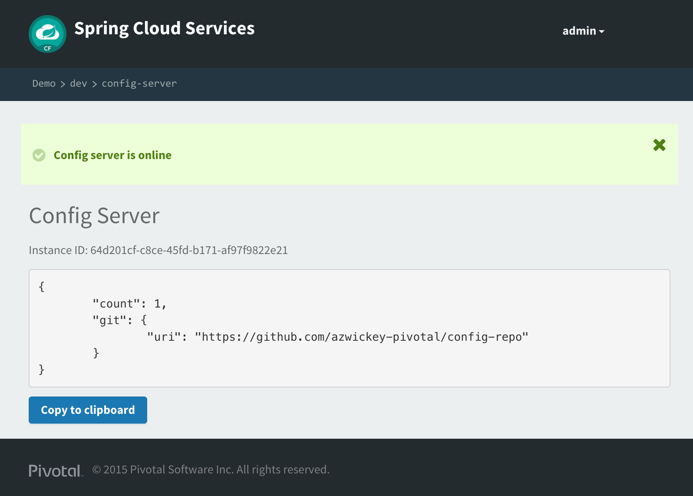

= Spring Cloud Configを使ったSpring Boot アプリケーション

Spring BootとSpring Cloudを使って、gitレポジトリから動的に構成を取得するアプリケーションを作成する

==  _Hello_ REST サービスの追加

.  _spring-cloud-services-starter-config-client_ をクラスパスに追加。  そのためにMavenを変更: */cloud-native-spring/pom.xml*. 以下のSpring Cloudのdependencyを追加:
+
[source, xml]
---------------------------------------------------------------------
<dependency>
  <groupId>io.pivotal.spring.cloud</groupId>
	<artifactId>spring-cloud-services-starter-config-client</artifactId>
</dependency>
---------------------------------------------------------------------

. さらにdependency managementにSpring Cloudを追加
+
[source, xml]
---------------------------------------------------------------------
<dependencyManagement>
	<dependencies>
		<dependency>
			<groupId>io.pivotal.spring.cloud</groupId>
			<artifactId>spring-cloud-services-dependencies</artifactId>
			<version>1.3.1.RELEASE</version>
			<type>pom</type>
			<scope>import</scope>
		</dependency>
		<dependency>
			<groupId>org.springframework.cloud</groupId>
			<artifactId>spring-cloud-dependencies</artifactId>
			<version>Camden.SR4</version>
			<type>pom</type>
			<scope>import</scope>
		</dependency>
	</dependencies>
</dependencyManagement>
---------------------------------------------------------------------

. @Valueアノテーション、privateのフィールド、さらに関連した内容を追加 _io.pivotal.CloudNativeSpringApplication_ (/cloud-native-spring/src/main/java/io/pivotal/CloudNativeSpringApplication.java):

+
[source, java, numbered]
---------------------------------------------------------------------
    @Value("${greeting:Hola}")
    private String _greeting;

    @RequestMapping("/")
    public String hello() {
        return _greeting + " World!";
    }
---------------------------------------------------------------------
+
コードの完成形:
+
[source,java,numbered]
---------------------------------------------------------------------
package io.pivotal;

import org.springframework.beans.factory.annotation.Value;
import org.springframework.boot.SpringApplication;
import org.springframework.boot.autoconfigure.SpringBootApplication;
import org.springframework.boot.autoconfigure.data.rest.RepositoryRestMvcAutoConfiguration;
import org.springframework.context.annotation.Import;
import org.springframework.data.jpa.repository.config.EnableJpaRepositories;
import org.springframework.web.bind.annotation.RequestMapping;
import org.springframework.web.bind.annotation.RestController;

@SpringBootApplication
@RestController
@EnableJpaRepositories
@Import(RepositoryRestMvcAutoConfiguration.class)
public class CloudNativeSpringApplication {

	public static void main(String[] args) {
		SpringApplication.run(CloudNativeSpringApplication.class, args);
	}

	@Value("${greeting:Hola}")
	private String _greeting;

	@RequestMapping("/")
	public String hello() {
		return _greeting + " World!";
	}
}
---------------------------------------------------------------------

. Spring Cloud Services Starter Config Client dependencyを定義した場合、 Spring Securityも同時に（勝手に）含まれている。Config ServerはOAuth2で保護されている。もちろんBASIC認証にすることも可能。
下記の構成を */cloud-native-spring/src/main/resources/application.yml* に追加する:

+
[source, yaml]
---------------------------------------------------------------------
security:
  basic:
    enabled:  false
---------------------------------------------------------------------

. 同様に、Spring Boot Appに対して名前を指定することで、アプリケーションに特化した構成を後々にconfig serverからルックアップすることが可能

+
[source, yaml]
---------------------------------------------------------------------
spring:
  application:
    name: cloud-native-spring
---------------------------------------------------------------------

. Complete YML:
+
[source, yaml]
---------------------------------------------------------------------
spring:
  application:
    name: cloud-native-spring

endpoints: # add this section
  sensitive: false

info: # add this section
  build:
    artifact: @project.artifactId@
    name: @project.name@
    description: @project.description@
    version: @project.version@

management:
  security:
    enabled: false
  info:
    git:
      mode: full
  cloudfoundry:
    enabled: true
    skip-ssl-validation: true

security:
  basic:
---------------------------------------------------------------------

== _cloud-native-spring_ アプリを実行

. まずは上記で設定したアプリケーションの起動
+
[source,bash]
---------------------------------------------------------------------
$ mvn clean spring-boot:run
---------------------------------------------------------------------

. http://localhost:8080 をブラウズしてあいさつ文が出るか確認

.  _cloud-native-spring_ を停止

== Spring Cloud Config Server インスタンスの作成

. アプリケーションの準備が整ったので、構成をコンフィグサーバから取得。そのためのコンフィグサーバをCloud Foundryのサービスより利用。App Managerからマーケットプレイスを確認する。
自身のワークスペースに移動して、Config Serverをデプロイ:
+
image::images/config-scs.jpg[]

. Detailsページに移動し、_standard_, single tenant planを選択.  インスタンス名(Instance Name)を*config-server* として、ワークスペース(Space)を選択。ここではアプリケーションへのバインドはせずに！(do not bind):
+
image::images/config-scs1.jpg[]

. サービス作成後、_Space_ ページに戻って確認。オンデマンドサービスのため、作成に少々時間がかかる。"_The Service Instance is Initializing_" のメッセージが消えたらサービスをクリックして確認。"manage"というリンクをクリックすると
インスタンスIDとJSONドキュメントが見えるので、内容を確認する:
+
image::images/config-scs2.jpg[]

. サービスインスタンスをgit repository情報を使ってupdateする必要がある。CLIを使ってConfig Serverのサービス内容を更新する:
+
[source,bash]
---------------------------------------------------------------------
$ cf update-service config-server -c '{"git": { "uri": "https://github.com/azwickey-pivotal/config-repo" } }'
---------------------------------------------------------------------

. Config Serverの管理ページを更新すると、下記のようなメッセージが見て取れる。reintializedが終わるまでスクリーンを更新する。
+


. 作成したConfig Serverをアプリケーションをバインド。下記の内容をマニフェストファイルに追加 */cloud-native-spring/manifest.yml*
+
[source, yml]
---------------------------------------------------------------------
  env:
    TRUST_CERTS: https://api.sys.az.pvjp.cf
  services:
  - config-server
---------------------------------------------------------------------
+
マニフェストファイルの完成形:
+
[source, yml]
---------------------------------------------------------------------
---
applications:
- name: cloud-native-spring
  host: cloud-native-spring
  memory: 512M
  instances: 1
  path: ./target/cloud-native-spring-0.0.1-SNAPSHOT.jar
  buildpack: java_buildpack_offline
  timeout: 180
  env:
    TRUST_CERTS: https://api.sys.az.pvjp.cf
    JAVA_OPTS: -Djava.security.egd=file:///dev/urandom
  services:
  - config-server
---------------------------------------------------------------------
+
path: ./target/cloud-native-spring-0.0.1-SNAPSHOT.jar
から
+
path: ./target/cloud-native-spring-0.0.1-SNAPSHOT-exec.jar
に変わっているので注意

== デプロイとテスト

. ビルド
+
[source,bash]
---------------------------------------------------------------------
$ mvn clean package
---------------------------------------------------------------------

. cf push
+
[source,bash]
---------------------------------------------------------------------
$ cf push -f manifest.yml
---------------------------------------------------------------------

. デプロイURLにアクセス、hello()サービスとして返っているかを確認。これによりConfig Serverより読み込まれたものがあることを確認
+
```
Bon Jour World!
```

. *何ができたか* -- Spring Cloud Starter Config Clientを使って _service connector_ により自動的にアプリケーションにバインドされるよう、Config Serverを検出。
サービスコネクターによりアプリケーションは自動的に構成され、Cloud Config Serverに接続し、構成をダウンロードし、アプリケーションに適用する

. 今回構成したgitレポジトリ, https://github.com/azwickey-pivotal/config-repo, において *cloud-native-spring.yml* というファイルがあるのがわかる。
このファイルネームはspring.application.nameにある値と同じ。構成自体はこのファイルから読まれる, 今回の場合、以下の内容を用意している:
+
[source, yaml]
---------------------------------------------------------------------
greeting: Bon Jour
---------------------------------------------------------------------

. 次に、どのようにサービスレジストリを使ってサービスを登録するかを学びます、またロードバランスリクエストの処理についても確認します

Lab05に続く
