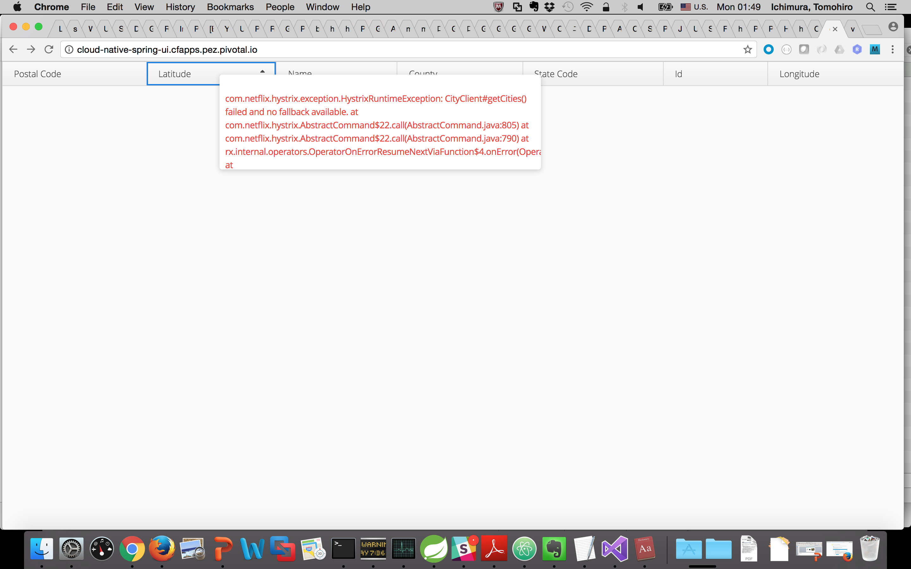

= Spring Cloudによるサービス登録とディスカバリ

Spring BootとSpring Cloudを使ってアプリケーション登録サービスをサービスレジストリを使って実装する。そのために、まずはEurekaサービスのインスタンスをプロビジョニングする。さらに、シンプルなクライアントアプリケーションを追加して、サービスレジストリからアプリケーションをルックアップして、変更依頼をCitiesサービスにかける

== _Cloud-Native-Spring_ アプリケーションを変更してEurekaを登録

. これらの機能は _spring-cloud-services-starter-service-registry_ をクラスパスに追加することで実装可能. Maven POMファイルを開いて編集する: */cloud-native-spring/pom.xml*. :
+
[source, xml]
---------------------------------------------------------------------
<dependency>
  <groupId>io.pivotal.spring.cloud</groupId>
	<artifactId>spring-cloud-services-starter-service-registry</artifactId>
</dependency>
---------------------------------------------------------------------
+

. Spring Cloudにより、Eurekaを使ってサービスレジストリのサービスが利用可能となる。@EnableDiscoveryClientをクラス名の前に追加する。
 _io.pivotal.CloudNativeSpringApplication_ (/cloud-native-spring/src/main/java/io/pivotal/CloudNativeApplication.java):
+
[source, java, numbered]
---------------------------------------------------------------------
@SpringBootApplication
@RestController
@EnableJpaRepositories
@EnableDiscoveryClient
@Import(RepositoryRestMvcAutoConfiguration.class)
public class CloudNativeSpringApplication {
---------------------------------------------------------------------
+
コードの最終形:
+
[source,java,numbered]
---------------------------------------------------------------------
package io.pivotal;

import org.springframework.beans.factory.annotation.Value;
import org.springframework.boot.SpringApplication;
import org.springframework.boot.autoconfigure.SpringBootApplication;
import org.springframework.boot.autoconfigure.data.rest.RepositoryRestMvcAutoConfiguration;
import org.springframework.cloud.client.discovery.EnableDiscoveryClient;
import org.springframework.context.annotation.Import;
import org.springframework.data.jpa.repository.config.EnableJpaRepositories;
import org.springframework.web.bind.annotation.RequestMapping;
import org.springframework.web.bind.annotation.RestController;

@SpringBootApplication
@RestController
@EnableJpaRepositories
@EnableDiscoveryClient
@Import(RepositoryRestMvcAutoConfiguration.class)
public class CloudNativeSpringApplication {

	public static void main(String[] args) {
		SpringApplication.run(CloudNativeSpringApplication.class, args);
	}

	@Value("${greeting:Hola}")
	private String _greeting;

	@RequestMapping("/")
	public String hello() {
		return _greeting + " World!";
	}
}
---------------------------------------------------------------------

== Spring Cloud Service Registry インスタンスを作成し、アプリをデプロイ

. Eurekaを使ったサービスレジストリを利用するためにインスタンスを作成し、アプリをデプロイする必要がある。まずは、マーケットプレイスからインスタンスを作成する.  前回はUIを使ったので、今回はCLIを使う:
+
[source,bash]
---------------------------------------------------------------------
$ cf create-service p-service-registry standard service-registry
---------------------------------------------------------------------

. 作成後、サービスレジストリのインスタンスが作成できていることを確認する。ワークスペース(space)にてインスタンスが確認できたら、"manage"リンクをクリック、ダッシュボードを表示する:
+
image::images/registry1.jpg[]

. 作成したインスタンスにアプリケーションをバインド。マニフェストファイルに以下の行をサービスとして追加 */cloud-native-spring/manifest.yml* :
+
[source, yml]
---------------------------------------------------------------------
  services:
  - config-server
  - service-registry
---------------------------------------------------------------------
+
最終的な内容:
+
[source, yml]
---------------------------------------------------------------------
---
applications:
- name: cloud-native-spring
  host: cloud-native-spring
  memory: 512M
  instances: 1
  path: ./target/cloud-native-spring-0.0.1-SNAPSHOT.jar
  buildpack: java_buildpack_offline
  timeout: 180
  env:
    CF_TARGET: https://api.sys.az.pvjp.cf
    JAVA_OPTS: -Djava.security.egd=file:///dev/urandom
  services:
  - config-server
  - service-registry
---------------------------------------------------------------------
+
場合によっては、_https://api.sys.az.pvjp.cf_ を 適宜編集する

== アプリケーションのデプロイ

. アプリケーションをビルド
+
[source,bash]
---------------------------------------------------------------------
$ mvn clean package
---------------------------------------------------------------------

. この後では、maven artifactをローカルレポジトリで使うため、下記のコマンドを実施
+
[source,bash]
---------------------------------------------------------------------
$ mvn install
---------------------------------------------------------------------

```
[INFO]
[INFO] --- maven-jar-plugin:2.6:jar (default-jar) @ cloud-native-spring ---
[INFO] Building jar: /Users/ichimt1/git/CN-Workshop-TM/labs/lab01/cloud-native-spring/target/cloud-native-spring-0.0.1-SNAPSHOT.jar
[INFO]
[INFO] --- spring-boot-maven-plugin:1.5.3.RELEASE:repackage (default) @ cloud-native-spring ---
[INFO] Attaching archive: /Users/ichimt1/git/CN-Workshop-TM/labs/lab01/cloud-native-spring/target/cloud-native-spring-0.0.1-SNAPSHOT-exec.jar, with classifier: exec
[INFO]
[INFO] --- maven-install-plugin:2.5.2:install (default-install) @ cloud-native-spring ---
[INFO] Installing /Users/ichimt1/git/CN-Workshop-TM/labs/lab01/cloud-native-spring/target/cloud-native-spring-0.0.1-SNAPSHOT.jar to /Users/ichimt1/.m2/repository/io/pivotal/cloud-native-spring/0.0.1-SNAPSHOT/cloud-native-spring-0.0.1-SNAPSHOT.jar
[INFO] Installing /Users/ichimt1/git/CN-Workshop-TM/labs/lab01/cloud-native-spring/pom.xml to /Users/ichimt1/.m2/repository/io/pivotal/cloud-native-spring/0.0.1-SNAPSHOT/cloud-native-spring-0.0.1-SNAPSHOT.pom
[INFO] Installing /Users/ichimt1/git/CN-Workshop-TM/labs/lab01/cloud-native-spring/target/cloud-native-spring-0.0.1-SNAPSHOT-exec.jar to /Users/ichimt1/.m2/repository/io/pivotal/cloud-native-spring/0.0.1-SNAPSHOT/cloud-native-spring-0.0.1-SNAPSHOT-exec.jar
[INFO] ------------------------------------------------------------------------
[INFO] BUILD SUCCESS
[INFO] ------------------------------------------------------------------------
[INFO] Total time: 15.552 s
[INFO] Finished at: 2017-05-14T08:17:36+09:00
[INFO] Final Memory: 35M/407M
[INFO] ------------------------------------------------------------------------

```

. Push application into Cloud Foundry
+
[source,bash]
---------------------------------------------------------------------
$ cf push -f manifest.yml
---------------------------------------------------------------------

. pushの結果として得られるURLは変更されないもののService Registry dashboard を確認すると、cloud-native-springが登録されていることがわかる:
+
image::images/registry2.jpg[]

. 次にシンプルなUIアプリケーションを作成する。サービスレジストリを使って以前作成したCities RESTサービスを検索して接続する

== 新しいSpring Boot Projectの作成

. https://start.spring.ioに移動

. Maven Project、Spring Boot 1.5.3.を選択

. *Project metadata* フィールドを以下のように編集:
+
Group:: +io.pivotal+
Artifact:: +cloud-native-spring-ui+

. In the dependencies section, add the following:
+
*Vaadin*, *Actuator*, *Feign*

. _Generate Project_ ボタンをクリック。zipファイルがダウンロードされる。

. ダウンロードしたファイルを *CN-Workshop-TM/labs/lab05/cloud-native-spring-ui* に配置
+
ダウンロード構成は以下のとおり:
+
[source, bash]
---------------------------------------------------------------------
CN-Workshop-TM:
├── labs
│   ├── lab01
│   │   ├── cloud-native-spring
│   ├── lab05
│   │   ├── cloud-native-spring-ui
---------------------------------------------------------------------

. pom.xmlを編集

. Spring Cloud dependency managementを追加するため、Maven POM ファイル: */cloud-native-spring-ui/pom.xml* を編集:
+
[source, xml]
---------------------------------------------------------------------
<dependencyManagement>
	<dependencies>
		<dependency>
			<groupId>io.pivotal.spring.cloud</groupId>
			<artifactId>spring-cloud-services-dependencies</artifactId>
			<version>1.3.1.RELEASE</version>
			<type>pom</type>
			<scope>import</scope>
		</dependency>
		<dependency>
			<groupId>org.springframework.cloud</groupId>
			<artifactId>spring-cloud-dependencies</artifactId>
			<version>Camden.SR4</version>
			<type>pom</type>
			<scope>import</scope>
		</dependency>
	</dependencies>
</dependencyManagement>
---------------------------------------------------------------------
```
dependencyManagement自体はすでに作成されていると思われるので、dependenciesの部分を追加
spring-cloud-dependencies もすでに作成されているかもしれないので、その場合はそちらを削除して、上記を残してみてください。

```
. 前回同様、サービスレジストリ _spring-cloud-services-starter-service-registry_ もクラスパスに追加:
+
[source, xml]
---------------------------------------------------------------------
<dependency>
  <groupId>io.pivotal.spring.cloud</groupId>
	<artifactId>spring-cloud-services-starter-service-registry</artifactId>
</dependency>
---------------------------------------------------------------------
+
ドメインオブジェクトも利用するので、以下のdependencyも追加:
+
[source, xml]
---------------------------------------------------------------------
<dependency>
  <groupId>io.pivotal</groupId>
	<artifactId>cloud-native-spring</artifactId>
	<version>0.0.1-SNAPSHOT</version>
</dependency>
---------------------------------------------------------------------
+
上記では、mvn installの結果を利用して、ライブラリとして読み込まれます。

. RESTサービスを利用するのでFeignを利用する。FeignによりRESTサービス関連の管理とJSONマーシャリング/アンマーシャリングをドメインオブジェクトに対して実施可能。
そのためのFeign Clientインターフェースを追加。Feignを利用するには、Eurekaサービスレジストリから名前をルックアップするのみ。以下のインターフェース定義をコードに実施 :
+
[source,java,numbered]
---------------------------------------------------------------------
  @FeignClient("https://cloud-native-spring")
  public interface CityClient {

  	@RequestMapping(method=RequestMethod.GET, value="/cities", consumes="application/hal+json")
  	Resources<City> getCities();
  }
---------------------------------------------------------------------
+
さらにいくつかのアノテーションも追加
+
[source,java,numbered]
---------------------------------------------------------------------
@SpringBootApplication
@EnableFeignClients
@EnableDiscoveryClient
public class CloudNativeSpringUiApplication {
---------------------------------------------------------------------
+
最終形:
+
[source,java,numbered]
---------------------------------------------------------------------
package io.pivotal;

import io.pivotal.domain.City;
import org.springframework.boot.SpringApplication;
import org.springframework.boot.autoconfigure.SpringBootApplication;
import org.springframework.cloud.client.discovery.EnableDiscoveryClient;
import org.springframework.cloud.netflix.feign.EnableFeignClients;
import org.springframework.cloud.netflix.feign.FeignClient;
import org.springframework.hateoas.Resources;
import org.springframework.web.bind.annotation.RequestMapping;
import org.springframework.web.bind.annotation.RequestMethod;

@SpringBootApplication
@EnableFeignClients
@EnableDiscoveryClient
public class CloudNativeSpringUiApplication {

	public static void main(String[] args) {
		SpringApplication.run(CloudNativeSpringUiApplication.class, args);
	}

	@FeignClient("https://cloud-native-spring")
	protected interface CityClient {

		@RequestMapping(method=RequestMethod.GET, value="/cities", consumes="application/hal+json")
		Resources<City> getCities();
	}
}

---------------------------------------------------------------------

. 次にVaadin UIを使ってデータレンダリングを実施。ここではUI作成の詳細までは実施しないがVaadinによりUI作成が簡易に実施可能。
UIはFeignクライアントを利用する。_io.pivotal.AppUI_ クラスを作成し、下記のコードをコピー(/cloud-native-spring-ui/src/main/java/io/pivotal/AppUI.java):

+
[source,java]
---------------------------------------------------------------------
package io.pivotal;

import com.vaadin.annotations.Theme;

import com.vaadin.server.VaadinRequest;
import com.vaadin.spring.annotation.SpringUI;
import com.vaadin.ui.Grid;
import com.vaadin.ui.UI;
import io.pivotal.domain.City;
import org.springframework.beans.factory.annotation.Autowired;

import java.util.ArrayList;
import java.util.Collection;

@SpringUI
@Theme("valo")
public class AppUI extends UI {

      private final CloudNativeSpringUiApplication.CityClient _client;
      private final Grid<City> _grid;

      @Autowired
      public AppUI(CloudNativeSpringUiApplication.CityClient client) {
          _client = client;
          _grid = new Grid<>(City.class);
      }

      @Override
      protected void init(VaadinRequest request) {
          setContent(_grid);
          _grid.setWidth(100, Unit.PERCENTAGE);
          _grid.setHeight(100, Unit.PERCENTAGE);
          Collection<City> collection = new ArrayList<>();
          _client.getCities().forEach(collection::add);
          _grid.setItems(collection);
      }
}
---------------------------------------------------------------------
. アプリケーションの名前を予め入れておき、きちんとEurekaに作成されることを確認。
下記をapplication.propertiesに記載( */cloud-native-spring-ui/src/main/resources/application.properties*):
+
[source, yaml]
---------------------------------------------------------------------
spring.application.name=cloud-native-spring-ui
---------------------------------------------------------------------
なお、application.properties or application.ymlで記載の仕方が異なるので注意

== デプロイ

. アプリケーションをビルドする。テストはスキップする（二つのBoot Appがclasspathにあるため失敗するので)
+
[source,bash]
---------------------------------------------------------------------
$ mvn clean package -DskipTests
---------------------------------------------------------------------

. manifest.ymlを作成する
+
$ touch manifest.yml

. メタデータを編集
+
[source, bash]
---------------------------------------------------------------------
---
applications:
- name: cloud-native-spring-ui
  host: cloud-native-spring-ui
  memory: 1G
  instances: 1
  path: ./target/cloud-native-spring-ui-0.0.1-SNAPSHOT.jar
  buildpack: java_buildpack_offline
  timeout: 180
  env:
    TRUST_CERTS: api.sys.az.pvjp.cf
    JAVA_OPTS: -Djava.security.egd=file:///dev/urandom
  services:
  - service-registry
---------------------------------------------------------------------

. CFにpush
+
[source,bash]
---------------------------------------------------------------------
$ cf push -f manifest.yml
---------------------------------------------------------------------

. アプリケーションにアクセス。Vaadin UIが確認できる。citiesマイクロサービスから返されるテーブルリストが確認できるはず。
+
image::images/ui.jpg[]

. コマンドラインからcloud-native-springを停止する (今回作成したUIではなく)
+
[source,bash]
---------------------------------------------------------------------
$ cf stop cloud-native-spring
---------------------------------------------------------------------
. UIアプリをリフレッシュすると何がおこりますか？ あまりうれしくない結果が返っていると想います。
+


. 次に、他のサービスの影響があった場合でも、UI自体を影響少なくする方法を見ていきます。

Lab06、最後のセッションです！
