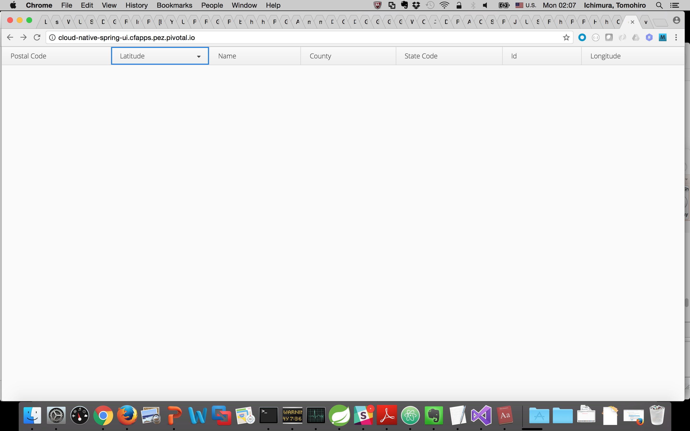

= Spring Cloud Circuit Breakerを登録

より堅牢なUIを作成するために、Spring Cloud Circuit Breakerを利用して、アプリケーションのふるまいを管理して、もし関連するサービスが利用不可のときにも持続性を維持するように構成する。
circuit break dashboardを使ってメトリクスを表示する, これらもCloud Foundry Pivotal Spring Cloud Servicesから自動プロビジョニングされる。

== Circuilt Breakerを定義 (_UI Application_ )

.  _spring-cloud-services-starter-circuit-breaker_ をクラスパスに追加. Maven POM ファイルはこちら: */cloud-native-spring-ui/pom.xml*. 下記のspring cloud services dependencyを追加する:
+
[source, xml]
---------------------------------------------------------------------
<dependency>
  <groupId>io.pivotal.spring.cloud</groupId>
	<artifactId>spring-cloud-services-starter-circuit-breaker</artifactId>
</dependency>
---------------------------------------------------------------------

. まず、 @EnableCircuitBreaker アノテーションを _io.pivotal.CloudNativeSpringUIApplication_ に追加する(/cloud-native-spring-ui/src/main/java/io/pivotal/CloudNativeSpringUIApplication.java):
+
[source, java, numbered]
---------------------------------------------------------------------
@SpringBootApplication
@EnableFeignClients
@EnableDiscoveryClient
@EnableCircuitBreaker
public class CloudNativeSpringUiApplication {
---------------------------------------------------------------------

. @FeignClient を追加したときにはインターフェースのみを定義していたので、今回はダミークラスを作成して、インターフェースを実装、フォールバックメソッドを定義。FeignClientのフォールバックメソッドも同時に定義。まずは
_CloudNativeSpringUIApplication_ にインナークラス _CityClientFallback_ を作成する。:
+
[source, java, numbered]
---------------------------------------------------------------------
  // ここから
  @Component
  public class CityClientFallback implements CityClient {
  	@Override
  	public Resources<City> getCities() {
  		// 空のレスポンスを返す
  		return new Resources(Collections.EMPTY_LIST);
  	}
  }

---------------------------------------------------------------------
+
. _@FeignClient_ アノテーションを編集して、作成したクラスをフォールバックとして定義:
+
[source, java, numbered]
---------------------------------------------------------------------
@FeignClient(name = "cloud-native-spring", fallback = CityClientFallback.class)
public interface CityClient {
---------------------------------------------------------------------
+
. これにより _CloudNativeSpringUiApplication_ は以下のようになる:
+
[source, java, numbered]
---------------------------------------------------------------------
package io.pivotal;

import io.pivotal.domain.City;
import org.springframework.boot.SpringApplication;
import org.springframework.boot.autoconfigure.SpringBootApplication;
import org.springframework.cloud.client.circuitbreaker.EnableCircuitBreaker;
import org.springframework.cloud.client.discovery.EnableDiscoveryClient;
import org.springframework.cloud.netflix.feign.EnableFeignClients;
import org.springframework.cloud.netflix.feign.FeignClient;
import org.springframework.hateoas.Resources;
import org.springframework.stereotype.Component;
import org.springframework.web.bind.annotation.RequestMapping;
import org.springframework.web.bind.annotation.RequestMethod;

import java.util.Collections;

@SpringBootApplication
@EnableFeignClients
@EnableDiscoveryClient
@EnableCircuitBreaker
public class CloudNativeSpringUiApplication {

	public static void main(String[] args) {
		SpringApplication.run(CloudNativeSpringUiApplication.class, args);
	}

	@FeignClient(name = "cloud-native-spring", fallback = CityClientFallback.class)
	public interface CityClient {
		@RequestMapping(method= RequestMethod.GET, value="/cities", consumes="application/hal+json")
		Resources<City> getCities();
	}

	@Component
	public class CityClientFallback implements CityClient {
		@Override
		public Resources<City> getCities() {
			//We'll just return an empty response
			return new Resources(Collections.EMPTY_LIST);
		}
	}
}

---------------------------------------------------------------------

== Circuit Breaker Dashboard（インスタンス)の作成

.  Hystrix Circuit Breakerを使うとアプリケーションが自動的にHystrixCommandでラップされたメソッドに関するメトリクスを通知。AMQPメッセージバスを経由したイベントは、Turbineに送られ、結果的にCircuit Breaker dashboardに出力される.
これを実現するために、cloud foundryのcircuit breakerサービスを使うように実装する:
+
[source,bash]
---------------------------------------------------------------------
$ cf create-service p-circuit-breaker-dashboard standard circuit-breaker-dashboard
---------------------------------------------------------------------

. Circuit Breaker Dashboard (Apps Managerの" _manage_ "リンクから確認できる) dashboardがデプロイされていることがわかる。しかし空のままで表示はされてない。 ( _initializing_ というメッセージが数秒出ている場合があるが、リフレッシュしているタイミングで発生しているのでしばらく様子を見る):
+
image::images/dash.jpg[]

. アプリケーションにcircuit-breaker-dashboardをバインドさせる設定をmanifestに記述(*/cloud-native-spring-ui/manifest.yml*). 下記のようにservicesのエントリに対して、一番最後の部分を追記する  :
+
[source, yml]
---------------------------------------------------------------------
  services:
  - service-registry
  - circuit-breaker-dashboard
---------------------------------------------------------------------

== Deploy and test application

. アプリケーションのビルド
+
[source,bash]
---------------------------------------------------------------------
$ mvn clean package -DskipTests
---------------------------------------------------------------------

. Push application into Cloud Foundry
+
[source,bash]
---------------------------------------------------------------------
$ cf push -f manifest.yml
---------------------------------------------------------------------

. 立ち上がったURLをチェック.  cities RESTサービスが停止していても、ブランクページが見えているはず.  前回違ったのを覚えてますか？フォールバックメソッドにより自動的に呼ばれて、フォールバックの振る舞いが行われたことがわかります。
+

. コマンドラインをつかって、元のマイクロサービスを再起動（UIではない)
+
[source,bash]
---------------------------------------------------------------------
$ cf start cloud-native-spring
---------------------------------------------------------------------

. ページをリフレッシュして再度ページが表示されることがわかる
+
image::../lab05/images/ui.jpg[]

. しばらくリフレッシュすると、サーキットブレーカーが反応する。ダッシュボードがメトリクスを表示してHystrix circuit breakerの状態を表すことがわかる
+
image::images/dash1.jpg[]

お疲れ様でした！すべてのLabが終わりです。
